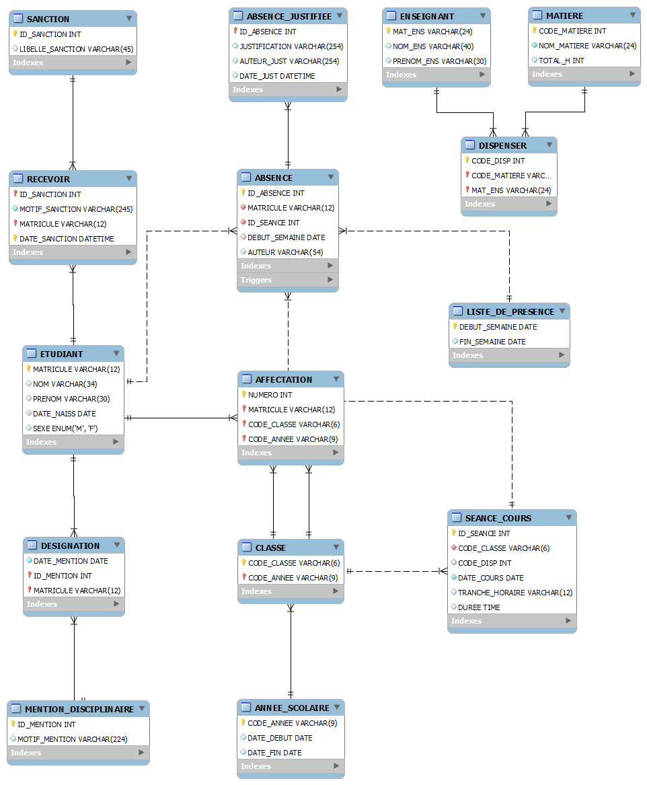
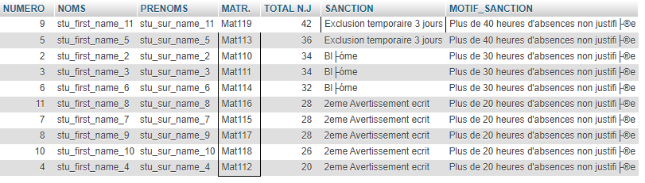

# school-discipline-management-database

Database for school discipline management system.

## Summary

1. About
2. Presentation and tutorial

## 1. About

### 1.1 Installation

This database run with mysql version 5.7.31 on windows 10.

Charset: CP850(DOS West European)

#### 1.1.1 Connect to MySQL Server

```mysql
mysql -u <user_name> - p
```

#### 1.1.2 Load database script

```mysql
mysql> \. setup.sql
```

#### 1.1.3 Load data

```mysql
mysql> \. data.sql
```

### 1.2 Contribution

Just do a pull request, it'll be a pleasure to receive your contribution.

### 1.3 Licence

This Database is shared with a Common Creative Licence : BY - NC - SA.

### 1.3 Authors

[SIKATI Samuel](https://linkedin.com/in/samuel-sikati-kenmogne-57953a1b7)

## 2. Presentation and tutorial

### 2.1 EER diagram of the database



### 2.2 Examples

[These queries are located to testqueries.sql](testqueries.sql)

#### 2.2.1 Example 1

> Show precisely all the student absences resume during a week (2021-02-01 to 2021-02-06)

```mysql
SELECT 
      affectation.`NUMERO` AS NUMERO,
      etudiant.NOM AS NOMS,
      etudiant.PRENOM AS PRENOMS,
      etudiant.MATRICULE AS `MATR.`,
      SUM(HOUR(seance_cours.DUREE)) AS `TOTAL H.A`,
      SUM(IF(absence.ID_ABSENCE = absence_justifiee.ID_ABSENCE,0,HOUR(seance_cours.DUREE)))  AS `TOTAL N.J`
FROM `absence` 
      INNER JOIN seance_cours on absence.ID_SEANCE = seance_cours.ID_SEANCE 
      INNER JOIN etudiant ON absence.MATRICULE = etudiant.MATRICULE 
      INNER JOIN affectation ON etudiant.MATRICULE = affectation.MATRICULE
      LEFT JOIN absence_justifiee ON absence.ID_ABSENCE = absence_justifiee.ID_ABSENCE 
WHERE
      affectation.CODE_ANNEE = '2020/2021' AND
      affectation.CODE_CLASSE = 'L2C' AND
      absence.DEBUT_SEMAINE = '2021-02-01'
GROUP BY 
      `NUMERO` 
ORDER BY 
      `NUMERO` 
ASC;
```

##### 2.2.1.1. Results


#### 2.2.2 Example 2

> List in descending order of gravity  the students going to the disciplinary council with thier sanctions in the school year

```mysql
SELECT 
      affectation.`NUMERO` AS NUMERO,
      etudiant.NOM AS NOMS,
      etudiant.PRENOM AS PRENOMS,
      etudiant.MATRICULE AS `MATR.`,
      SUM(IF(absence.ID_ABSENCE = absence_justifiee.ID_ABSENCE,0,HOUR(seance_cours.DUREE)))  AS `TOTAL N.J`, 
      SANCTION.LIBELLE_SANCTION AS SANCTION,
      recevoir.MOTIF_SANCTION
FROM `absence` 
      INNER JOIN seance_cours on absence.ID_SEANCE = seance_cours.ID_SEANCE 
      INNER JOIN etudiant ON absence.MATRICULE = etudiant.MATRICULE
      INNER JOIN recevoir ON etudiant.MATRICULE = recevoir.MATRICULE
      INNER JOIN sanction ON recevoir.ID_SANCTION = SANCTION.ID_SANCTION
      INNER JOIN affectation ON etudiant.MATRICULE = affectation.MATRICULE
      LEFT JOIN absence_justifiee ON absence.ID_ABSENCE = absence_justifiee.ID_ABSENCE 
WHERE
      affectation.CODE_ANNEE = '2020/2021' AND
      affectation.CODE_CLASSE = 'L2C' AND
      (MONTH(seance_cours.DATE_COURS) BETWEEN 1 AND 3) AND
      SANCTION.ID_SANCTION = (SELECT DISTINCT MAX(ID_SANCTION) FROM RECEVOIR WHERE RECEVOIR.MATRICULE = ETUDIANT.MATRICULE)
GROUP BY 
      etudiant.NOM 
ORDER BY 
      `TOTAL N.J` 
DESC;
```

##### 2.2.2.1. Results


